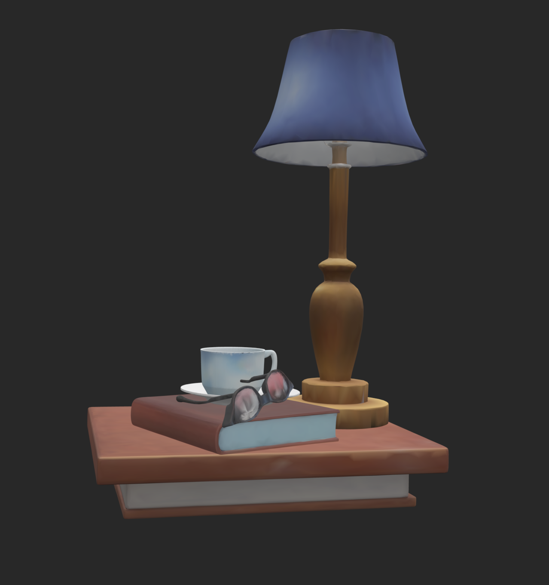
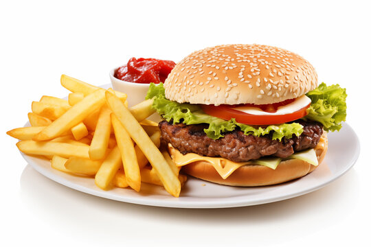
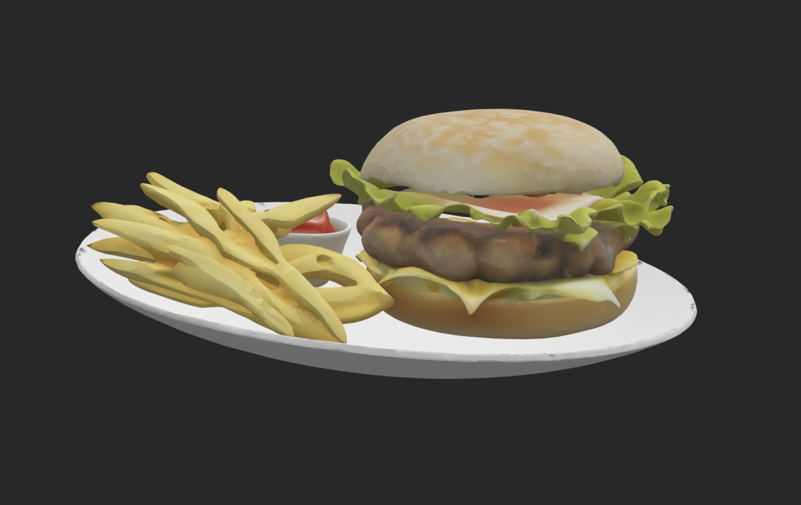

# Monocular Image-to-3D With Physics Correction

This repo is a pipeline for converting single images into fully reconstructed 3D scenes with seperate mesh objects, combining methods from [this paper](https://arxiv.org/abs/2502.12894) with ICP-based point cloud alignment. 

## Segmentation

First, the image is segmented. The image is passed into a multi-modal LLM (such as Qwen2.5VL or GPT5.2) to extract object tags. These object tags are then passed alongside the iamge into SAM3 to produce segmentation masks for each image. We then apply a containment filter, removing all masks contained entirely within others to remove duplicates.

## SAM3D Generation

THe masks are then passed into SAM3D alongside the original image, producing roughly posed mesh objects for each mask. These objects are very crudely positioned and oriented, so additional correction is necessary.

## Point Cloud Alignment

The image is passed into MoGE to generate a point cloud for the scene. The masks are then applied to the point cloud, projecting out as frustrums to isolate the points for each object (since each object is associated with an image mask). After a rough scale alignment between SAM3D's coordinate space and MoGE's, Iterative Closest Point is then applied to each SAM3D object, aligning with their MoGE counterparts. This serves as rough correction.

## SDF-Based Correction

Each SAM3D mesh is converted into an SDF grid, where each grid point is the signed distance to the nearest surface of the object. We run a correction loop for 500 iterations, and at each iteration, an SDF-based loss is computed. For each target object, we project every other object into its local coordinate space, and sample that target object's SDF grid using trilinear interpolation to calculate penetration depth for each contacting object. There are additional components to the loss which are better explained by reading the code at src/cast/correction/sdf.py. We then utilize backpropagation to minize this loss, resulting in a scene with minimal object inter-penetration. TLDR: At each iteration we compute a loss which is more or less a function of how much each object penetrates every other object within the scene. By minimizing this loss using gradient descent, we arrive at a physically plausible scene with little penetration.

# Examples

## Lamp Scene

Original Image:


3D Scene:


## Food Scene

Original Image:


3D Scene:


# AutoSegment Setup guide

Create conda env:

```
conda create --name autoseg python=3.11
conda activate autoseg
```

Exports:

```
export AM_I_DOCKER=False
export BUILD_WITH_CUDA=True
export CUDA_HOME=/usr/local/cuda-11.5 
```

Clone Grounded-Segment-Anything repo:

```
git clone https://github.com/IDEA-Research/Grounded-Segment-Anything
mv Grounded-Segment-Anything/GroundingDINO GroundingDINO
mv Grounded-Segment-Anything/segment_anything segment_anything
```

Install SAM3:

```
git clone https://github.com/facebookresearch/sam3.git
cd sam3
pip install -e .

pip install pycocotools
pip install matplotlib
```

Install GPT dependencies:

```
pip install openai 
pip install dotenv
```

Install PyTorch

```
pip install --force-reinstall torch torchvision torchaudio --index-url https://download.pytorch.org/whl/cu121
```

Install diffusers:

```
pip install --upgrade diffusers[torch]
```

Install RAM:

```
git clone https://github.com/xinyu1205/recognize-anything.git
pip install -r ./recognize-anything/requirements.txt
pip install -e ./recognize-anything/
```

Correct opencv, numpy, and transformers:

```
pip install opencv-python==4.8.1.78
pip install "numpy>=1.26,<2"
pip install transformers==4.35.2  
```

Einops

```
pip install einops
```

Download model weights:

```
wget https://huggingface.co/spaces/xinyu1205/Tag2Text/resolve/main/ram_swin_large_14m.pth
wget https://huggingface.co/spaces/xinyu1205/Tag2Text/resolve/main/tag2text_swin_14m.pth

hf download facebook/sam3 --local-dir ./sam3-checkpoint
```

Install Llama CPP and Qwen-7B-Instruct

```
git clone https://github.com/ggml-org/llama.cpp.git
cd llama.cpp
rm -rf build
cmake -B build -DGGML_CUDA=ON -DCMAKE_CUDA_HOST_COMPILER=gcc-9 -DCMAKE_C_COMPILER=gcc-9 -DCMAKE_CXX_COMPILER=g++-9
cmake --build build --config Release

huggingface-cli download bartowski/Qwen2-VL-7B-Instruct-GGUF Qwen2-VL-7B-Instruct-Q4_K_M.gguf --local-dir .
huggingface-cli download bartowski/Qwen2-VL-7B-Instruct-GGUF mmproj-Qwen2-VL-7B-Instruct-f16.gguf --local-dir .
```

Qwen2.5

```
huggingface-cli download bartowski/Qwen_Qwen2.5-VL-7B-Instruct-GGUF Qwen_Qwen2.5-VL-7B-Instruct-Q5_K_M.gguf --local-dir .
huggingface-cli download bartowski/Qwen_Qwen2.5-VL-7B-Instruct-GGUF mmproj-Qwen_Qwen2.5-VL-7B-Instruct-f16.gguf --local-dir .
```

# SAM3D Setup

Create sam3d-objects environment

```
conda create --name sam3d-objects python=3.11
conda activate sam3d-objects
```

For pytorch/cuda dependencies

```
export PIP_EXTRA_INDEX_URL="https://pypi.ngc.nvidia.com https://download.pytorch.org/whl/cu121"
```

Install sam3d-objects and core dependencies

```
git clone https://github.com/EmpiricalCode/sam-3d-objects-gsplat
mv sam-3d-objects-gsplat sam-3d-objects
cd sam-3d-objects
pip install torch==2.5.1+cu121 --index-url https://download.pytorch.org/whl cu121
pip install numpy psutil
pip install flash-attn==2.8.3 --no-build-isolation
pip install hatchling
pip install -e '.[dev]' --no-build-isolation                                                                                                                                                  
pip install -e '.[p3d]' --no-build-isolation

pip install torch==2.5.1+cu121 --index-url https://download.pytorch.org/whl/cu121 
pip install numpy psutil
pip install flash-attn==2.8.3 --no-build-isolation 
pip install pytorch3d@git+https://github.com/facebookresearch/pytorch3d.git@75ebeeaea0908c5527e7b1e305fbc7681382db47 --no-build-isolation 
pip install -e '.[dev]' 
```

For inference

```
export PIP_FIND_LINKS="https://nvidia-kaolin.s3.us-east-2.amazonaws.com/torch-2.5.1_cu121.html"
pip install -e '.[inference]'
```

Patch things that aren't yet in official pip packages

```
./patching/hydra # https://github.com/facebookresearch/hydra/pull/2863
```

Install checkpoints

```
pip install 'huggingface-hub[cli]<1.0'

TAG=hf
hf download \
  --repo-type model \
  --local-dir checkpoints/${TAG}-download \
  --max-workers 1 \
  facebook/sam-3d-objects
mv checkpoints/${TAG}-download/checkpoints checkpoints/${TAG}
rm -rf checkpoints/${TAG}-download
```

Install nvdiffrast (necessary for saving as .glb)

```
pip install setuptools wheel ninja
pip install git+https://github.com/NVlabs/nvdiffrast.git --no-build-isolation
```

# MoGE Setup

Create env

```
conda create --name moge python=3.10
conda activate moge

```

```
git clone https://github.com/microsoft/MoGe.git
cd MoGe
pip install -r requirements.txt   # install the requirements
pip install torch==2.5.1+cu121 torchvision==0.20.1+cu121 --index-url https://download.pytorch.org/whl/cu121  
pip install pytorch3d -f https://dl.fbaipublicfiles.com/pytorch3d/packaging/wheels/py310_cu121_pyt251/download.html 
```

# SDF Setup

```
conda create --name sdf python=3.10
conda activate sdf
```

Install

```
pip install numpy                                                         
pip install trimesh                                                       
pip install mesh-to-sdf                                                   
pip install matplotlib                                                    
pip install pyrender                                                      
pip install pyglet 
pip install openai  
pip install python-dotenv

pip install fvcore iopath
pip install --no-index --no-cache-dir pytorch3d -f https://dl.fbaipublicfiles.com/pytorch3d/packaging/wheels/py310_cu118_pyt200/download.html

pip install torch
pip install torchvision
```

Inference

```
PYOPENGL_PLATFORM=egl python3 poc/optimize_sdf.py --dir output/sam3d_results --resolution 32 
```

Sam3D Parallel Inference

```
python -m torch.distributed.run --nproc_per_node=3 poc/run_sam3d_parallel.py --image ...
```