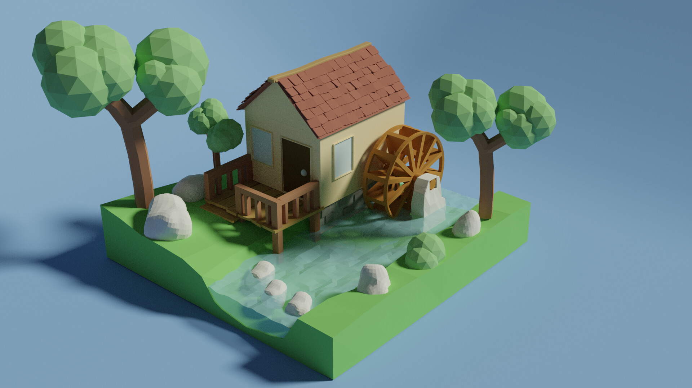
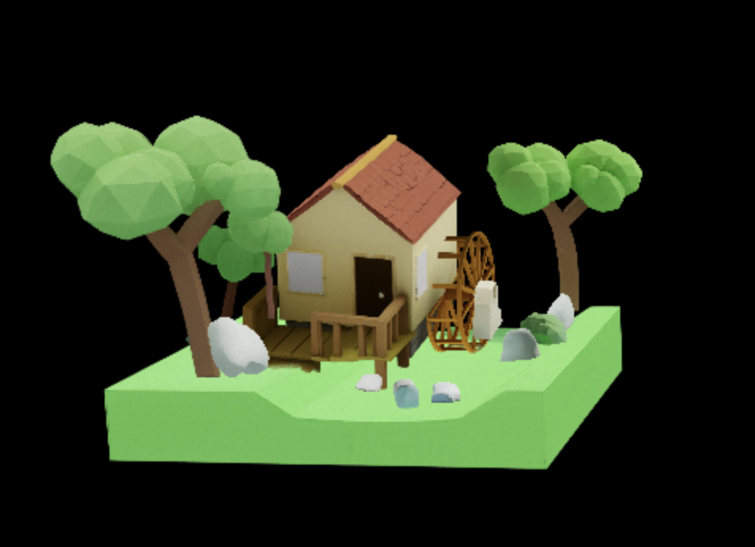
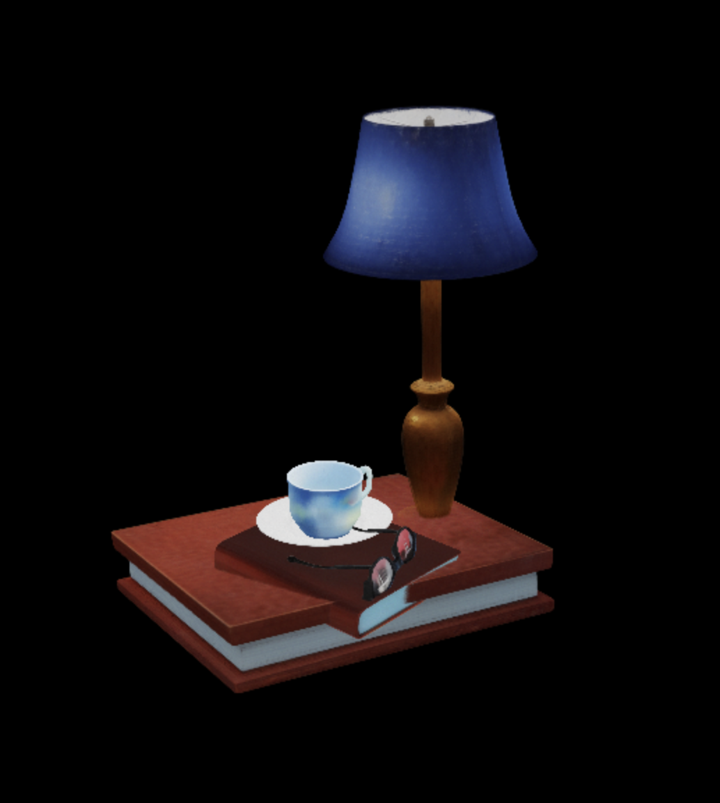

## CAST Using SAM3D + Graph-based SDF Physics Correction

## Examples

### House Scene

Original Image:


3D Scene:


### Lamp Scene

Original Image:


3D Scene:


# AutoSegment Setup guide

Create conda env:

```
conda create --name autoseg python=3.11
conda activate autoseg
```

Exports:

```
export AM_I_DOCKER=False
export BUILD_WITH_CUDA=True
export CUDA_HOME=/usr/local/cuda-11.5 
```

Clone Grounded-Segment-Anything repo:

```
git clone https://github.com/IDEA-Research/Grounded-Segment-Anything
mv Grounded-Segment-Anything/GroundingDINO GroundingDINO
mv Grounded-Segment-Anything/segment_anything segment_anything
```

Install SAM:

```
python -m pip install -e segment_anything
```

Install GPT dependencies:

```
pip install openai 
pip install dotenv
```

Install PyTorch

```
pip install torch==2.0.1 torchvision==0.15.2 torchaudio==2.0.2 --index-url https://download.pytorch.org/whl/cu118
```

Install GroundingDINO

```
pip install --no-build-isolation -e GroundingDINO
```

Install diffusers:

```
pip install --upgrade diffusers[torch]
```

Install RAM:

```
git clone https://github.com/xinyu1205/recognize-anything.git
pip install -r ./recognize-anything/requirements.txt
pip install -e ./recognize-anything/
```

Correct opencv, numpy, and transformers:

```
pip install opencv-python==4.8.1.78
pip install numpy==1.26.4
pip install transformers==4.35.2  
```

Download model weights:

```
wget https://dl.fbaipublicfiles.com/segment_anything/sam_vit_h_4b8939.pth
wget https://github.com/IDEA-Research/GroundingDINO/releases/download/v0.1.0-alpha/groundingdino_swint_ogc.pth

wget https://huggingface.co/spaces/xinyu1205/Tag2Text/resolve/main/ram_swin_large_14m.pth
wget https://huggingface.co/spaces/xinyu1205/Tag2Text/resolve/main/tag2text_swin_14m.pth
```

Install Llama CPP and Qwen-7B-Instruct

```
git clone https://github.com/ggml-org/llama.cpp.git
cd llama.cpp
rm -rf build
cmake -B build -DGGML_CUDA=ON -DCMAKE_CUDA_HOST_COMPILER=gcc-9 -DCMAKE_C_COMPILER=gcc-9 -DCMAKE_CXX_COMPILER=g++-9
cmake --build build --config Release

huggingface-cli download bartowski/Qwen2-VL-7B-Instruct-GGUF Qwen2-VL-7B-Instruct-Q4_K_M.gguf --local-dir .
huggingface-cli download bartowski/Qwen2-VL-7B-Instruct-GGUF mmproj-Qwen2-VL-7B-Instruct-f16.gguf --local-dir .
```

Qwen2.5

```
huggingface-cli download bartowski/Qwen_Qwen2.5-VL-7B-Instruct-GGUF Qwen_Qwen2.5-VL-7B-Instruct-Q5_K_M.gguf --local-dir .
huggingface-cli download bartowski/Qwen_Qwen2.5-VL-7B-Instruct-GGUF mmproj-Qwen_Qwen2.5-VL-7B-Instruct-f16.gguf --local-dir .
```

# SAM3D Setup

Create sam3d-objects environment

```
mamba env create -f environments/default.yml
mamba activate sam3d-objects
```

For pytorch/cuda dependencies

```
export PIP_EXTRA_INDEX_URL="https://pypi.ngc.nvidia.com https://download.pytorch.org/whl/cu121"
```

Install sam3d-objects and core dependencies

```
git clone https://github.com/EmpiricalCode/sam-3d-objects-gsplat
cd sam-3d-objects
pip install -e '.[dev]'
pip install -e '.[p3d]' # pytorch3d dependency on pytorch is broken, this 2-step approach solves it
```

For inference

```
export PIP_FIND_LINKS="https://nvidia-kaolin.s3.us-east-2.amazonaws.com/torch-2.5.1_cu121.html"
pip install -e '.[inference]'
```

Patch things that aren't yet in official pip packages

```
./patching/hydra # https://github.com/facebookresearch/hydra/pull/2863
```

Install checkpoints

```
pip install 'huggingface-hub[cli]<1.0'

TAG=hf
hf download \
  --repo-type model \
  --local-dir checkpoints/${TAG}-download \
  --max-workers 1 \
  facebook/sam-3d-objects
mv checkpoints/${TAG}-download/checkpoints checkpoints/${TAG}
rm -rf checkpoints/${TAG}-download
```

Install nvdiffrast (necessary for saving as .glb)

```
pip install setuptools wheel ninja
pip install git+https://github.com/NVlabs/nvdiffrast.git --no-build-isolation
```

# SDF Setup

```
conda create -n sdf
conda activate sdf
```

Install

```
pip install numpy                                                         
pip install trimesh                                                       
pip install mesh-to-sdf                                                   
pip install matplotlib                                                    
pip install pyrender                                                      
pip install pyglet 
pip install openai  
pip install python-dotenv

pip install fvcore iopath
pip install --no-index --no-cache-dir pytorch3d -f https://dl.fbaipublicfiles.com/pytorch3d/packaging/wheels/py310_cu118_pyt200/download.html
```

Inference

```
PYOPENGL_PLATFORM=egl python3 poc/optimize_sdf.py --dir output/sam3d_results --resolution 32 
```

Sam3D Parallel Inference

```
python -m torch.distributed.run --nproc_per_node=3 poc/run_sam3d_parallel.py --image ...
```